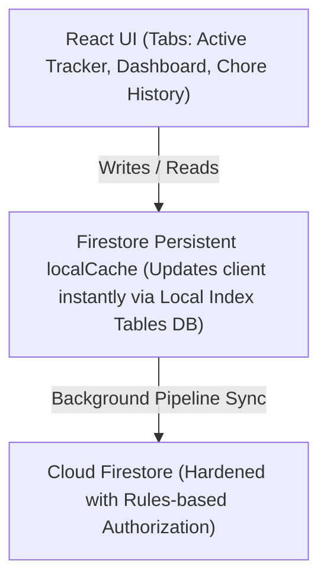

# Technical Architecture & Developer Onboarding Guide

Welcome! This document provides a high-level technical overview of the Chore Tracker codebase and acts as an index to our modular documentation.

---

## 🧭 System Overview

The application is structured as an offline-capable, real-time reactive Single Page Application (SPA). It uses a hybrid guest/cloud structure:

1. **Guest Mode**: Utilizes `localStorage` caches if the user chooses not to authenticate.
2. **Synchronized Cloud Mode**: Leverages **Firebase Firestore** with persistent local caching to achieve seamless real-time syncing across authenticated client devices.

---

## 📚 Documentation Map

For deep dives into specific subsystems, please refer to the following documentation modules:

- **State Management & Syncing**
  - [Sync Engine & State Management](state/sync-engine.md)
- **Security & Authorization**
  - [Security & Authorization Model](auth/security-model.md)
- **UI Components**
  - [ChoreForm Component](components/chore-form.md)
  - [Audio Synthesis Engine](components/audio-synthesis.md)
- **API & Error Handling**
  - [Error Handling & Query Limits](api/error-handling.md)
- **Deployment**
  - [Android Native Deployment (Capacitor)](deployment/android-capacitor.md)

---

## 🔐 Environment Configuration

### Firebase Credentials
All Firebase configuration is loaded from environment variables (never hardcoded). The following variables must be set in a `.env` file at the project root:

| Variable | Description |
|---|---|
| `VITE_FIREBASE_API_KEY` | Firebase Web API key |
| `VITE_FIREBASE_AUTH_DOMAIN` | Firebase Auth domain (e.g., `your-project.firebaseapp.com`) |
| `VITE_FIREBASE_PROJECT_ID` | Firebase project ID |
| `VITE_FIREBASE_STORAGE_BUCKET` | Firebase Storage bucket |
| `VITE_FIREBASE_MESSAGING_SENDER_ID` | Firebase Cloud Messaging sender ID |
| `VITE_FIREBASE_APP_ID` | Firebase app ID |
| `VITE_FIREBASE_FIRESTORE_DATABASE_ID` | Firestore database ID (defaults to `(default)` if empty) |
| `VITE_FIREBASE_MEASUREMENT_ID` | Firebase Analytics measurement ID (optional) |

A template with placeholder values is available in `.env.example`. Copy it to `.env` and fill in the actual credentials.

> **Important**: The file `firebase-applet-config.json` is listed in `.gitignore` and must never be committed to version control.

---

## 🚀 Developers Onboarding Checklist

When introducing new features or modifying the tracker, respect the following coding patterns:

### Adding a New Column/Property to Chores:
1. Update Interfaces: Add the new property into `Chore` in `src/types.ts`.
2. Update Firestore Blueprint: Define its schema boundaries inside `firebase-blueprint.json`.
3. Harden Firestore Rules: Extend the logic inside `firestore.rules` under `isValidChore()` and the whitelist block to support the parameters safely.
4. Environment Variables: If new Firebase configuration fields are needed, ensure they are added to `.env.example` with the `VITE_` prefix.
5. Run standard test compilations.

### Modifying Audio Signals:
- Ensure oscillator node types remain `'sine'` or `'triangle'` to protect speakers and headphone users from high-frequency clicks.
- Apply smooth release gain decays (`exponentialRampToValueAtTime`) to gracefully silence active voice nodes prior to the call of `.stop()`.

### Modifying the Content Security Policy:
- When adding new external dependencies (scripts, styles, fonts, iframes), update the corresponding CSP directive in the `<meta>` tag in `index.html`.
- Always test Firebase Google Sign-In after modifying CSP, as the Auth popup flow depends on `script-src` (for `https://apis.google.com`) and `frame-src` (for `https://*.firebaseapp.com`).
- Avoid adding `'unsafe-eval'` to `script-src` unless absolutely necessary.

### Rules of Engagement (Build Systems):
> 🛑 ARCHITECTURAL CONSTRAINTS
> - **Dependencies**: Never add client-side libraries manually with static script tags. Add them via `package.json` package installs.
> - **Port bindings**: Dev environments must always map to port `3000` and host `0.0.0.0` for container proxies.
